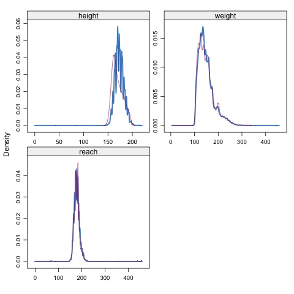

```{r global_options, include = FALSE}
knitr::opts_chunk$set(warning=FALSE, message=FALSE)
```
                      
### Load necessary packages 
I'm going to be using the `tidyverse`, `ggplot2` and `gridExtra` packages to manipulate and visualise the data, `mice` will be used for some example imputation and `hrbrthemes` is a library of `ggplot` themes that I'm trying out; the `hrbrthemes` link can be found [here](https://github.com/hrbrmstr/hrbrthemes) for more information about that package. 

```{r load_packages}
library(tidyverse)
library(ggplot2)
library(mice)
library(hrbrthemes)
library(gridExtra)
```

### Load the data
Now that we have read in the libraries, we can actually read in the data and start exploring. 

```{r read_data}
data <- read_csv('./input/bouts_out_new.csv')
glimpse(data)
```  

This tells us that we have 26 variables, and over 385,000 observations; that is a lot of boxing matches included for us to explore! 

Even from the glimpse, we can see that we are missing some information for the physical stats, namely the weight of the boxers. 
We will have to explore further to see the extent of the missing values. 
The physical characteristics of the boxers that I'm going to focus on during this analysis are: 
- Height
- Weight
- Reach (essentially a measurement for arm length)

Firstly, before we have a look at the null values and the extent of what is missing, let's collate the boxer information by joining the `boxer_A` and `boxer_B` stats. 
It may be worth considering the age of the boxer as well, but I will focus on the 3 physical characteristics named above. 

We want to gather the boxer data together, and remove the other columns that we aren't interested in for the sake of this analysis. 
We don't have any indexing for individual boxers, so I imagine that there will likely be duplication of individual boxers. 

## Gather the boxers and explore the variables
I'm going to this but first splitting the boxers into two separate data frames and then joining them one on top of the other. 

```{r combine_boxers}
A_boxers <- data %>% select(height_A, weight_A, reach_A) %>% rename(height = height_A, weight = weight_A, reach = reach_A)
B_boxers <- data %>% select(height_B, weight_B, reach_B) %>% rename(height = height_B, weight = weight_B, reach = reach_B)
all_boxers <- bind_rows(A_boxers, B_boxers)
full_boxers <- all_boxers %>% filter(complete.cases(.)) # Remove those with missing values for visualisations
```

### Physical characteristics distributions 
Let's visualise the distribution of the 3 physical measurements. 

```{r distributions_fig}
full_boxers %>% 
    gather('measurement', 'value') %>%
    ggplot(aes(value, fill = measurement), alpha = .75) + 
        geom_histogram(bins = 50) + 
        geom_rug(alpha = .1) +
        facet_wrap(~ measurement, scale = 'free_x') + # free_x important as measurements are using different units
        labs(x = NULL, y = NULL) + 
        theme_ipsum() + 
        theme(axis.text.x = element_text(angle = 90)) 
        
full_boxers %>% 
    gather('measurement', 'value') %>%
    ggplot(aes(x = measurement, y = value, fill = measurement), alpha = .75) + 
        geom_boxplot() + 
        facet_grid(~ measurement, scale = 'free', space = 'free') + 
        labs(x = NULL, y = NULL) + 
        theme_ipsum()
```

*_Observations_*:
- Height appears to be relatively well inputted, whereas both reach and weight appear to have some outliers; particularly reach has some incredibly large ones. 
- All three variables have outliers that can be better observed when visualised with boxplots.
    - These values are probably created as a result of poor data input as the values are physically impossible. 

### Cleaning the variables for visualisation
I'm going to remove some of the observations for the variables to keep only those that fall within a certain range. 

### Variable relationships
#### Height and Weight
```{r height_weight}
ggplot(full_boxers, aes(weight, height)) + 
    geom_point(alpha = 0.1, shape = 1) + # Try and account for large number of data points
    geom_smooth(method = 'lm', colour = '#e67e22', alpha = 0.6, size = 0.5) + # Add linear model  
    labs(x = "Weight (lbs)", y = "Height (cm)", title = 'Boxer height vs. weight') + # Relabel axis
    scale_x_continuous(limits = c(0, 350), expand = c(0,0)) +
    scale_y_continuous(limits = c(0, 230), expand = c(0,0)) + # Force height to start from 0
    theme_ipsum()
```


#### Height and Reach 
```{r height_reach}
ggplot(full_boxers, aes(reach, height)) + 
    geom_point(alpha = 0.1, shape = 1) + # Try and account for large number of data points
    geom_smooth(method = 'lm', colour = '#0abde3', alpha = 0.6, size = 0.5) + # Add linear model  
    labs(x = "Reach (cm)", y = "Height (cm)", title = 'Boxer height vs. reach') + # Relabel axis
    scale_x_continuous(limits = c(0, 250), expand = c(0,0)) +
    scale_y_continuous(limits = c(0, 230), expand = c(0,0)) + # Force height to start from 0
    theme_ipsum()
```

#### Weight and Reach 
```{r weight_reach}
ggplot(full_boxers, aes(weight, reach)) + 
    geom_point(alpha = 0.1, shape = 1) + # Try and account for large number of data points
    geom_smooth(method = 'lm', colour = '#ff9ff3', alpha = 0.6, size = 0.5) + # Add linear model  
    labs(x = "Weight (lbs)", y = "Reach (cm)", title = 'Boxer reach vs. weight') + # Relabel axis
    scale_x_continuous(limits = c(0, 350), expand = c(0,0)) +
    scale_y_continuous(limits = c(0, 250), expand = c(0,0)) + # Force height to start from 0
    theme_ipsum()
```  

We can see that all of the variables are positively related, which makes sense if you think about it. 

## Imputation of variables using `mice`

We have been looking at the complete cases from the `all_boxers` data frame that we created for the sake of the visualisations, but now lets go back to using `all_boxers` which contains missing values. 
We can say that the data that we are going to be imputing from this data frame is missing completely at random (MCAR) and that is because a boxer is going to have a height and a weight, and that missing values represent a value not being available to record, rather than representing a lack of height for example.  

```{r view_missing_values}
sapply(all_boxers, FUN = function(x) sum(is.na(x))/length(x))
```  

Looking at this table confirms that we are missing a lot of physical characteristics from the table we have here. We have about 50% of heights, 35% of weights and only 20% of reaches.  

Realistically, as we can see, there are too many missing values here to viably impute these values on a large scale for every observation. If you were going to use that information to make predictions or for further analysis, it would lead to inaccuracies based on the imputation rather than true knowledge and data.  

From reading around, I would say that the general consensus is that imputation isn't really done when you are missing more than a third of the values for a variable, given that you have the information in the other places to be able to make good assumptions. 

I am going to select a sample of the observations and then use `mice` to impute the other values more to practise the process of imputation; I have decided that I will use those rows with 2 of the 3 values to impute the final characteristic.  

A simple way to impute the values could be by using the median of the variable to fill in the blanks, but this probably isn't the most accurate way. 


Using one of capabilities of the `mice` package we are able to see the nature of our missing data using the `md.pattern` function. 

```{r mp_pattern_1}
md.pattern(all_boxers)
```

This function is super helpful and tells us how many of the rows have certain `NA` breakdowns; 67151 observations have all 3 measurements, while 315 have only the boxer's reach recorded. 

We will start by only keeping those boxers where we have at least 2 of the 3 physical measurements: height, weight and reach. Essentially looking for those rows that have a 1 in the far right column of the `md.pattern` summary table.  

As we can see from this summary, a lot of the variables have significant missing variables, in this case I would suggest that they cannot be used particularly for prediction given that the majority are going to imputed from the small number of records that we have. 

```{r}
boxers_impute <- all_boxers %>%
    rowwise() %>% # Look via the rows 
    dplyr::mutate(na_count = sum(is.na(reach), is.na(height), is.na(weight))) %>% # Create column that we can filter by
    filter(na_count <= 1) 

# Comparison of ways to compute this    
na_count <- apply(all_boxers, 1, function(row) sum(is.na(row)))
na_count <- na_count[na_count <= 1]

table(na_count == boxers_impute$na_count)

# We could append the vector as a column / filter based on boolean version of the vector 
```


Now that we have filter the to only include those observations with 1 or less missing values, we can compare using `md.pattern` again to make sure that we don't have any errors in our process. 

```{r}
boxers_impute <- select(boxers_impute, -na_count)
md.pattern(boxers_impute)
```

The numbers match up so we can continue with the analysis with the `boxers_impute` data frame. 

*Finally some actual imputation*... this took a long time to run (presumably because of the number of rows that I wanted to impute), so I saved the results as a csv file and then subsequently uploaded them to Kaggle to improve the loading time of the Kernel. 

```{r}
# imputation_model <- mice(boxers_impute, m=1, maxit=1, seed=1000)
# imputed_data <- complete(imputation_model)
# write_csv(x = imputed_data, path = 'imputed_boxers.csv')

# Read in the imputed data via csv 
imputed_data <- read_csv('./input/imputed_boxers.csv')
```  

I've read in the results of the mice imputation above, and included the code (although commented out) that was used to generate the data frame `imputed_data`.  
We can view the results and make sure that we have computed all the values through doing the same checks that we did before. 


```{r}
head(imputed_data, n=15)
```

```{r}
sapply(imputed_data, FUN = function(x) sum(is.na(x))/length(x))
```
  
There we go! We have eliminated all the `NA` values from our data, and are left with a complete set of values. We would be able to view the differences between the imputed datasets (single dataset in our set) and compare it to the original distirbutions. More information about how you can do that can be found [here](https://datascienceplus.com/imputing-missing-data-with-r-mice-package/).  

I haven't generated the figures in the kernel as I don't have direct access to the model required to do so. I have generated the plot locally and loaded here for you to see as an example.  

```{r}
# library(VIM) # Load the library
# density_plot <- densityplot(imputation_model) # Create visualisation
# png('imputed_density_plot.png')
# densityplot(imputation_model)
# dev.off()
```  


